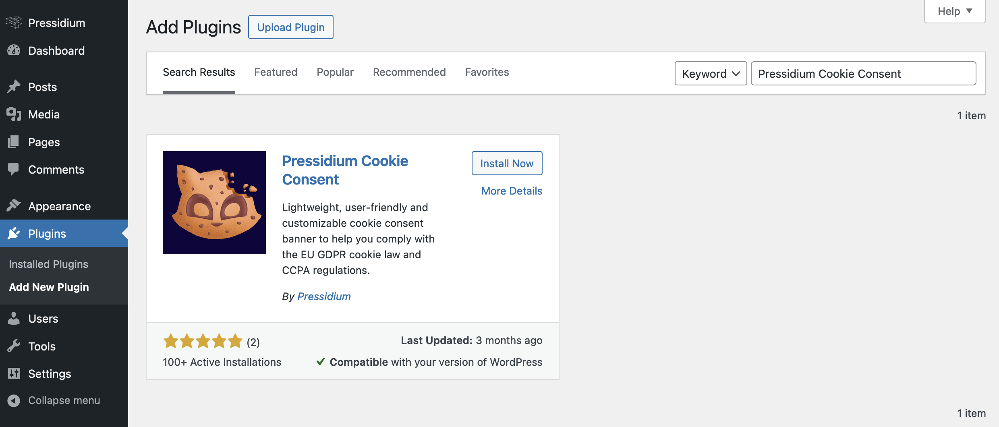
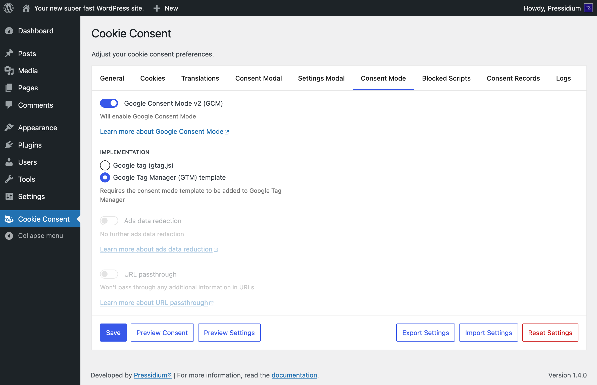
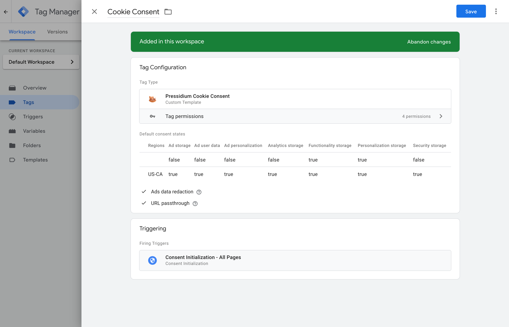
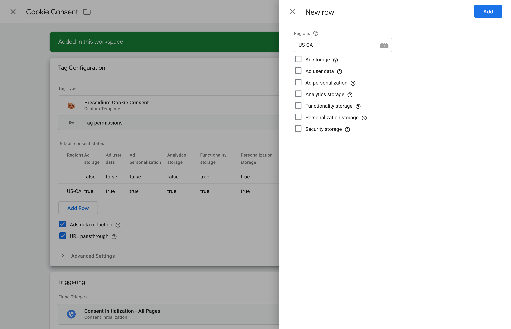

    

# Pressidium Cookie Consent GTM Template

🍪 A Google Tag Manager consent template for the
[Pressidium Cookie Consent](https://wordpress.org/plugins/pressidium-cookie-consent/) WordPress plugin.

## Table of Contents

* [Setup](#setup)
  * [Install the Pressidium Cookie Consent plugin](#install-the-pressidium-cookie-consent-plugin)
  * [Configure Google Consent Mode (GCM)](#configure-google-consent-mode-gcm)
  * [Install the GTM template](#install-the-gtm-template)
  * [Configure the GTM tag](#configure-the-gtm-tag)
* [Features](#features)
* [Bugs & Features](#bugs--features)
* [License](#license)

## Setup

You need to install the Pressidium Cookie Consent plugin on your WordPress site
and configure it to work with the GTM template.

### Install the Pressidium Cookie Consent plugin

Let’s get started by installing the
[Pressidium Cookie Consent](https://wordpress.org/plugins/pressidium-cookie-consent/) WordPress plugin:

1. Log in to your WordPress dashboard 
2. Navigate to the “Plugins” menu
3. Search for “Pressidium Cookie Consent”
4. Click “Install Now” and WordPress will take it from there
5. Activate the plugin through the “Plugins” menu on WordPress

Alternatively, you could manually download it from its
[GitHub repository](https://github.com/pressidium/pressidium-cookie-consent).

### Configure Google Consent Mode (GCM)

1. Navigate to the “Cookie Consent” menu
2. Under the “Consent Mode” tab, enable “Google Consent Mode v2 (GCM)”
3. Select the “Google Tag Manager (GTM) template” option as the “Implementation”
4. Click “Save”

### Install the GTM template

1. Navigate to the [Community Template Gallery](https://tagmanager.google.com/gallery/)
2. Search for “Pressidium Cookie Consent”
3. Select the template and click “Add to workspace”
4. Select the workspace where you want to add the template and click “Add”
5. Click “Add” again to confirm
6. Click “Submit” to save the changes

### Configure the GTM tag

1. Navigate to [Google Tag Manager](https://tagmanager.google.com/)
2. Select the workspace where you added the template
3. Navigate to the “Tags” menu
4. Click “New” to create a new tag
5. Under “Tag Configuration”, click “Choose a tag type to begin setup”
6. Select the “Pressidium Cookie Consent” template
7. Configure the tag as needed
8. Under the “Triggering” section, click “Choose a trigger to make this tag fire”
9. Select “Consent Initialization - All Pages”
10. Click “New” to create a new trigger
11. Click “Save”
12. Click “Submit” to save the changes

Under the “Tag Configuration” section, you can configure the following settings:

* Default consent states
* Ads data redaction
* URL passthrough

Under “Default consent states”, click “Add Row” to add a new row for each region. For each row, you can set the
regions as a comma-separated list of [ISO 3166-2](https://en.wikipedia.org/wiki/ISO_3166-2) codes (leave blank
to have your selection apply to all regions) and the default consent state for each consent type.

If two rows are set with values for a region and subregion, the one with a more specific region will take effect.
For example, if you have `ad_storage` set to `true` for `US`, and `ad_storage` set to `false` for `US-CA`,
a visitor from California will have the more specific `US-CA` setting take effect. For this example, that would
mean a visitor from California would have `ad_storage` set to `false`.

| Region      | Ad storage | Behavior                                   |
|-------------|------------|--------------------------------------------|
| `US`        | `true`     | Applies to all US states except California |
| `US-CA`     | `false`    | Applies to California                      |
| Unspecified | `true`     | Applies to all other regions               |

## Features

### 🌍 Region-specific default consent states

The template allows you to set different default consent states for different regions. This is useful if you need to
comply with different privacy laws in different regions.

You can set the default consent state for each consent type:

* Ad storage
* Ad user data
* Ad personalization
* Analytics storage
* Functionality storage
* Personalization storage
* Security storage

for any region by specifying its [ISO 3166-2](https://en.wikipedia.org/wiki/ISO_3166-2) code.

### 🕵️ Ads data redaction

When the “Ad storage” consent type is denied, ad click identifiers sent in
network requests by Google Ads and Floodlight will be redacted. Network requests will also be sent through
a cookieless domain

### 📡 URL passthrough

Will pass through ad click, client ID, and session ID information in URLs.

## Bugs & Features

If you’ve spotted any bugs, or would like to request additional features from this template, please
[open an issue](https://github.com/pressidium/pressidium-cookie-consent-gtm-template/issues).

## License

Apache License 2.0, check the [`LICENSE`](./LICENSE) file.
